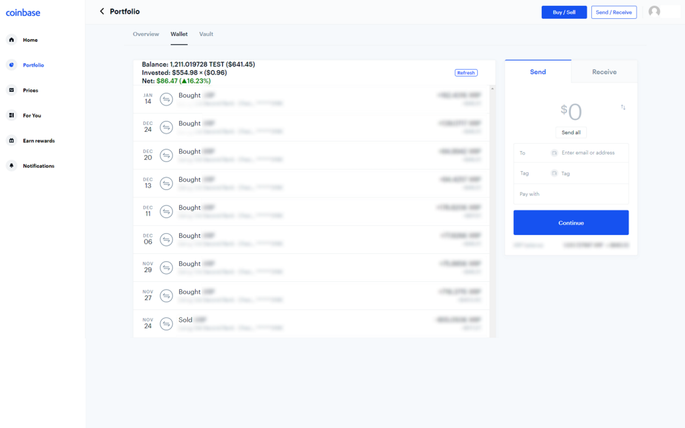

# Investment Stats for Coinbase
This extension allows you to see vital information on your investments on Coinbase. It is enabled within the Wallet page of any cryptocurrency.

This extension will show you:
- The amount you have invested
- The net profit of your investments
- The breakeven point of your investments
- The percentage net worth of your investments in comparison to the breakeven point

Once enabled, simply navigate to one of your Coinbase wallets to see your investment statistics.
[Chrome Webstore Download](https://chrome.google.com/webstore/detail/investment-stats-for-coin/hgdhmdhnjphbkcnpihgdnajlpejpcgmo)

